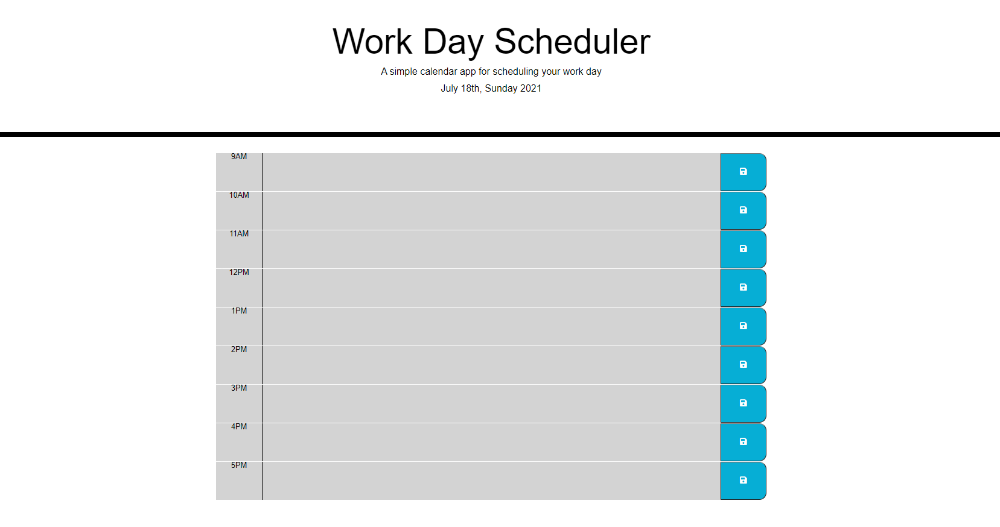

# _Work Day Scheduler_
> A simple calendar app for scheduling your work day.
> Live demo [_here_](https://darolo13.github.io/Work-Day-Scheduler/). 

## Table of Contents
* [Technologies Used](#technologies-used)
* [Features](#features)
* [Screenshot](#screenshot)
* [Project Status](#project-status)
* [Room for Improvement](#room-for-improvement)

## Technologies Used
- Tech 1 - JavaScript
- Tech 2 - CSS
- Tech 3 - HTML

## Features
Ready Features:
1. **current date in the header.**
2. **displays buisness hours and dur hour with colors:**
- gray = past.
- red = present.
- green = future.
3. **task input:**
- the user can use the text areas to know the task he has saved and when the current time is near that task

## Screenshot
### Work Day Scheduler:

## Project Status
Project is: _in progress_

## Room for Improvement
Room for improvement:
- Time picker
- Design

To do:
- Add more handy tools to the scheduler
- Improve design
- Add alarms
